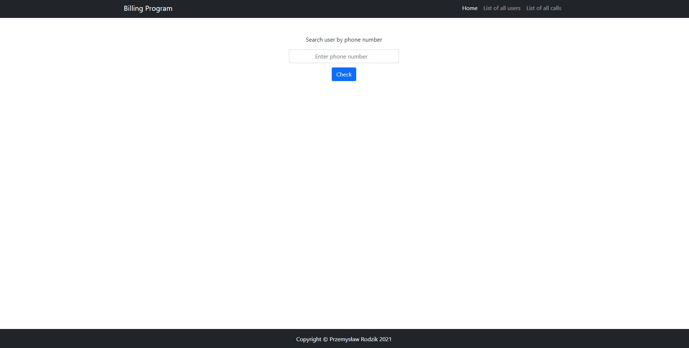
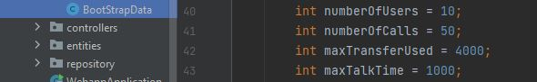
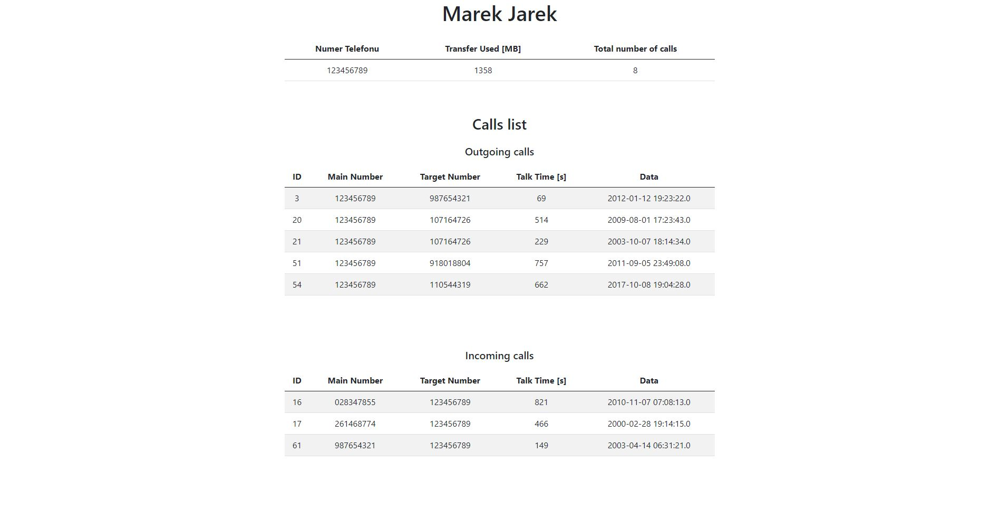

# Billing System

## Table of contents
* [General info](#general-info)
* [Manual Guide](#Manual-Guide)
* [Overview](#Overview)
* [Technologies used](#Technologies-used)
* [Sample program results](#Sample-program-results)

## General info
The interface allows the user to browse the calls database, user database and search for 
user data by phone number. The top panel allows you to switch between the main page, the list 
of users and the list of connections. To view the data of a selected user, enter his phone 
number in the designated field. The first two users and the call in between them is always generated 
by default. The remaining connections and users are generated randomly according to the given
criteria.

## Manual Guide
To run Internet applications on your own device, compile WebappApplication and then enter 
[http://localhost:8080/home](http://localhost:8080/home) in the browser.

### How to open DataBase

To run the h2 DataBase console you need to copy the URL, 

go to the page [http://localhost:8080/h2-console/](http://localhost:8080/h2-console/)
paste the URL in the JDBC URL field and then press the connect button.

Then you can browse the collected data, on this page you can edit, add and delete all 
records from the database.

### Changing Data
You can manipulate the number of users and calls by changing these variables.

## Overview

### Repositories
The central interface in Spring Data repository abstraction is Repository.It takes the domain class to manage as
well as the id type of the domain class as type arguments. This interface acts primarily as a marker interface to 
capture the types to work with and to help you to discover interfaces that extend this one.

### Entities
Entities in JPA are nothing but POJOs(Plain Old Java Object) representing data that can be persisted to the database.
An entity represents a table stored in a database. Every instance of an entity represents a row in the table.

### Component
The JPA component enables you to store and retrieve Java objects from persistent storage using EJB 3's Java Persistence
Architecture (JPA), which is a standard interface layer that wraps Object/Relational Mapping (ORM) products 
such as OpenJPA, Hibernate, TopLink.

### Controller
We can annotate classic controllers with the @Controller annotation. This is simply a specialization of the @Component class, 
which allows us to auto-detect implementation classes through the classpath scanning.

## Technologies used

* HTML5
* Java (Spring Boot, JPA Repository, Thymeleaf, Projectlombok)
* SQL (h2 DataBase)
* CSS (BootStrap)
* JavaScript

### Browser support
The project has been prepared for the browser *Google Chrome v84+*

## Sample program results

### Users List

### Calls List

### Detailed User View

